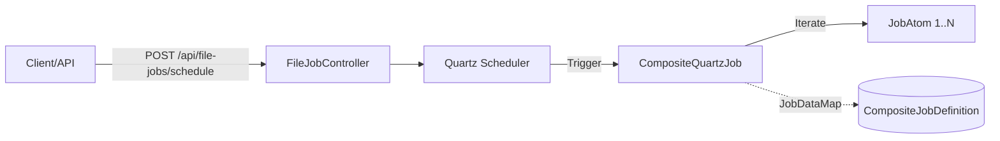
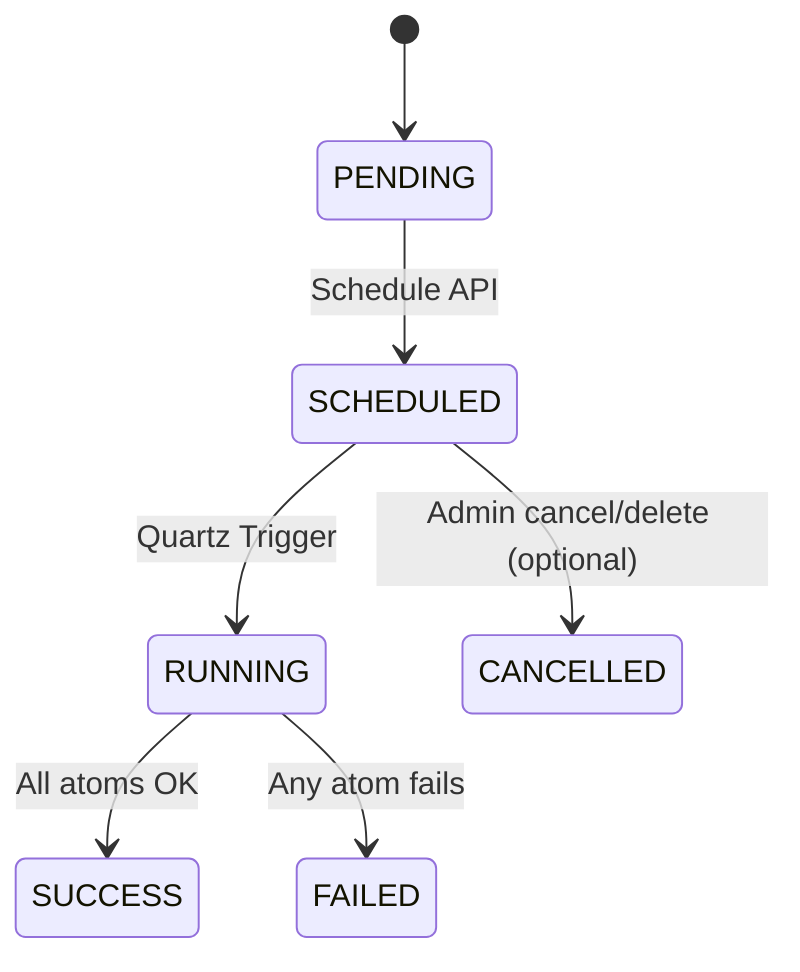

Batch Service (Quartz-based File Composite Jobs)
===============================================

- JDK 17, Gradle 8.14, Spring Boot 3.2.5
- Quartz, Spring Web, AOP, (DB: MySQL/MariaDB via JDBC for Quartz store)

실행 방법
---------
1) `.env` 혹은 IntelliJ EnvFile로 DB 접속 정보 주입 (커밋 금지)
- `DB_HOST, DB_PORT, DB_NAME, DB_USERNAME, DB_PASSWORD`
2) 애플리케이션 실행: `./gradlew bootRun`

서비스 개요
-----------
- 파일 작업을 원자적 작업(JobAtom)으로 정의하고, 여러 원자 작업을 하나의 컴포지트 잡으로 결합하여 Quartz에 스케줄링합니다.
- 트랜잭션 단위: 컴포지트 잡 실행 전체를 하나의 경계로 처리합니다. (파일 시스템은 DB처럼 롤백되지 않으므로 필요 시 보상 로직을 단계적으로 확장)

컴포넌트 구조
-------------


잡 생명주기(FSM)
-----------------


API 설계: 컴포지트 파일 잡 등록
-------------------------------
- Endpoint: `POST /api/file-jobs/schedule`
- Request
```json
{
  "jobName": "fs-maintenance",
  "rootDir": "D:/data",
  "steps": [
    {"type":"mkdir",  "path":"backup/2025-08-17"},
    {"type":"read",   "path":"in/report.txt", "ctxKey":"content"},
    {"type":"write",  "path":"backup/2025-08-17/report.txt", "ctxKey":"content"},
    {"type":"move",   "path":"in/report.txt", "to":"archive/report.txt"},
    {"type":"delete", "path":"tmp/old.log"}
  ],
  "startEpochMillis": null
}
```

- Step 타입별 필드
  - `mkdir`: path
  - `read`: path, ctxKey(선택, 기본 `content`)
  - `write`: path, ctxKey(기본 `content`) — 사전 컨텍스트에 키가 있으면 해당 값(byte[]/String)으로 기록
  - `move`: path(from), to
  - `delete`: path

- Validation
  - `jobName`: 1~64자, 영숫자/하이픈/언더스코어/점만 허용
  - `rootDir`: 절대 경로 권장(운영체제 규칙 준수)
  - 모든 `path`는 `rootDir` 기준 상대경로로 해석 (루트 이탈 방지를 위해 정규화/검증 권장)
  - `steps`는 1개 이상, 각 타입별 필수 필드 충족해야 함

- Response
```json
{ "scheduled": true, "jobKey": "file-jobs.file-composite-fs-maintenance" }
```

실행 플로우
-----------
```mermaid
flowchart TD
  A[CompositeQuartzJob start] --> B[Load CompositeJobDefinition]
  B --> C{For each JobAtom}
  C -->|execute| D[atom.execute(sharedContext)]
  D --> E{Exception?}
  E -->|No| C
  E -->|Yes| F[JobExecutionException -> FAILED]
  C -->|done| G[SUCCESS]
```

FSM로 설계해야 할까?
---------------------
- 결론: 생명주기 관점의 최소 FSM(PENDING→SCHEDULED→RUNNING→SUCCESS/FAILED)은 유지하는 것이 적절합니다. 이는 모니터링/운영 관점에서 상태 일관성을 보장합니다.
- 원자 작업 수준에서 복잡한 분기/루프/외부 이벤트 대기를 포함한다면, 전체를 FSM(혹은 워크플로 엔진)으로 모델링하는 것이 유리합니다. 현재 파일 I/O 직선형 플로우는 단순 순차 실행이 적합합니다.

확장 포인트
-----------
- 보상(Undo) Atom: 실패 시 이전 단계에 대한 보상 동작을 정의하여 사실상 Saga 패턴에 근접한 복구 제공
- Per-step Root(다중 트리): step에 `root`(절대경로) 허용하여 `rootDir`를 오버라이드 (보안 검증 필수)
- Cron 스케줄링 옵션: `cron` 필드 추가 지원 (현 버전은 단발성 실행 초점)
- 관찰성: 실행 로그/메트릭/트레이스(성공/실패, 소요시간, 실패 원자 명)

보안/안전 가이드
----------------
- 경로 정규화 및 루트 이탈 방지(`..` 차단)
- 권한/소유자 정책 반영(운영체제 권한)
- 대용량 파일 쓰기 시 임시파일+원자적 rename 전략 권장

